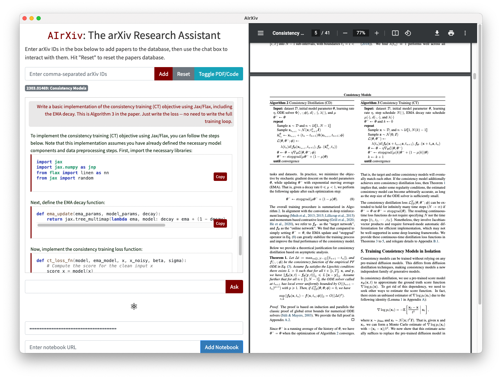

# AIrXiv

AIrXiv is a prototype for an LLM-powered ArXiv research assistant. It is an Electron-powered app with a Flask backend and uses the OpenAI API.

[](https://opensource.org/licenses/MIT)



## Installation

0. (Prerequisites) Make sure you have [Node.js](https://nodejs.org/en/download) and Python >=3.7.
1. Clone and `cd` into the repo:
```
git clone https://github.com/smsharma/AIrXiv.git
cd AIrXiv
```
2. Install the required Python packages using the provided environment.yml file. You can use Conda or any other environment manager of your choice:
```
conda env create -f environment.yml
conda activate airxiv
```
3. Install the required Node.js packages by running the following command:
```
npm install
```

## Usage

Run the Electron app with 
```
npm run dev
```
which launches the Python/Flask backend as well as the frontend. Add an arXiv ID or two, enter your [OpenAI API Key](https://platform.openai.com/account/api-keys) in the text box towards the bottom, and start asking questions!

Usage notes:
- Either `gpt-3.5-turbo` or `gpt-4` can be selected in the app settings. `gpt-4` is significantly better in particular at implementing code, but is about an order of magnitude more expensive (~$0.02/1000 tokens) compared `gpt-3.5-turbo`, and additionally API access is subject to a waitlist.
- Paper querying can be turned off by checking "Don't query papers" in the settings. This simply queries the general capabilities of the model.

## License

AIrXiv is licensed under the [MIT License](LICENSE.md).